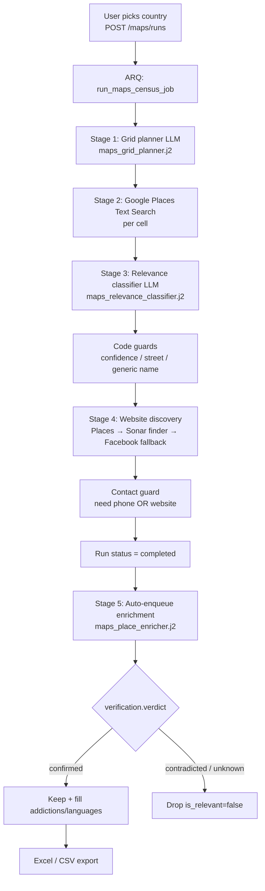

# Google Maps Census Scraper — Full Workflow Guide

**Last updated:** 2026-07-31

This document explains the standalone **Maps Census** feature end to end: what it does, which files own each step, every LLM prompt used in the pipeline, the deterministic guards that run after the models, the config caps, the data model, and the API / UI entry points.

It is independent of the Scraping Council pipeline. Results live in their own tables (`maps_census_runs`, `maps_census_cells`, `maps_places`) so the two systems can later be compared.

---

## 1. What it does (one sentence)

For one country, the Maps Census plans a geographic search grid, queries **Google Places Text Search**, classifies each hit as in-scope or not, finds websites (or Facebook pages), then uses a web-search LLM to **verify** each facility and fill **addictions treated** + **languages spoken**. Surviving rows export to Excel.

---

## 2. Current census scope

A place stays in the census only if **all** of these are true:

1. **Non-government** — private, NGO, or charity-funded (not ministry / public hospital / state program).
2. **Inpatient / residential** addiction program, **OR** a **private addictologue / addiction specialist** practice that explicitly treats addiction.
3. **Core mission** = clinical treatment of substance and/or behavioral addictions.
4. **Physical street address** (Plus-Code-only pins are dropped).
5. At least one **contact channel** (phone **or** website/Facebook).
6. After AI enrichment: web search must **`confirm`** the facility — `unknown` and `contradicted` both drop the row.

---

## 3. File map

### Backend — API

| Path | Role |
|---|---|
| `backend/app/api/v1/maps.py` | FastAPI routes under `/api/v1/maps` |
| `backend/app/api/v1/router.py` | Mounts the maps router (`prefix="/maps"`) |
| `backend/app/schemas/api.py` | `MapsCensusRunCreate`, `MapsCensusRunDetail`, `MapsPlaceItem`, etc. |

### Backend — services (pipeline)

| Path | Role |
|---|---|
| `backend/app/services/scraping/maps_census_service.py` | Orchestrator: create run, execute census, classify, websites, guards, CSV export, ARQ jobs |
| `backend/app/services/scraping/maps_grid_planner.py` | LLM grid planning (city × query cells) |
| `backend/app/services/scraping/maps_places_client.py` | Google Places API client (Text Search + photo) |
| `backend/app/services/scraping/maps_place_enrichment_service.py` | AI web-search enrichment + verification (Sonar Pro) |
| `backend/app/services/scraping/maps_export_service.py` | Excel (`.xlsx`) export — single `Facilities` sheet |

### Backend — prompts (Jinja2)

| Path | Stage | Default model |
|---|---|---|
| `backend/app/prompts/scraping/maps_grid_planner.j2` | 1 — Plan search grid | `gpt-4.1` (`MAPS_CENSUS_MODEL`) |
| `backend/app/prompts/scraping/maps_relevance_classifier.j2` | 3 — Classify relevance | `gpt-4.1` |
| `backend/app/prompts/scraping/maps_website_finder.j2` | 4 — Find website (LLM mode, default) | `sonar-pro` |
| `backend/app/prompts/scraping/maps_website_selector.j2` | 4 — Pick URL from Serper candidates (legacy mode) | `gpt-4.1` |
| `backend/app/prompts/scraping/maps_place_enricher.j2` | 5 — Verify + enrich addictions/languages | `sonar-pro` |

### Backend — data & config

| Path | Role |
|---|---|
| `backend/app/db/models.py` | `MapsCensusRun`, `MapsCensusCell`, `MapsPlace` (+ status enums) |
| `backend/app/core/config.py` | All `maps_census_*` settings |
| `.env.example` | Documented env vars |
| `backend/alembic/versions/` | Migrations for maps tables / verification columns (e.g. `030_maps_place_ai_verification.py`) |

### Backend — worker jobs

Defined at the bottom of `maps_census_service.py`:

| Job | Purpose |
|---|---|
| `run_maps_census_job` | Full census pipeline |
| `refresh_maps_census_websites_job` | Manual / auto website refresh |
| `run_maps_census_enrichment_job` | AI enrichment + verification |
| `recover_maps_census_runs` | Stale-run recovery |
| `auto_refresh_maps_census_websites` | Cron: retry missing websites |

### Frontend

| Path | Role |
|---|---|
| `src/routes/maps.route.tsx` | Maps workspace shell |
| `src/routes/maps.index.tsx` | List past runs |
| `src/routes/maps.new.tsx` | Start a new country census |
| `src/routes/maps.$runId.tsx` | Run detail, polling, Excel download, Enrich with AI |
| `src/components/maps/*` | Composer, cards, badges, place photos |
| `src/lib/maps/api.ts` | Frontend API client |

### Design specs (historical)

| Path | Topic |
|---|---|
| `docs/superpowers/specs/2026-07-30-google-places-maps-census-design.md` | Original feature design |
| `docs/superpowers/specs/2026-07-30-verified-only-maps-results-design.md` | Verified / export gates |
| `docs/superpowers/specs/2026-07-31-maps-complete-excel-export-design.md` | Excel export |
| `docs/superpowers/specs/2026-07-31-maps-ai-search-enrichment-design.md` | AI enrichment + verification |

---

## 4. End-to-end pipeline



### Stage order inside `run_census()`

1. Mark run `running`
2. **Plan grid** (`maps_grid_planner`)
3. Persist `MapsCensusCell` rows
4. For each cell: **Places Text Search** → upsert `MapsPlace` (dedupe by `google_place_id`)
5. **Classify** pending places in batches
6. **Post-classification filters** (confidence, address, generic name)
7. **Validate / find websites** + social fallback + contact filter
8. Mark run `completed`, recount relevant / with-website
9. Optionally enqueue **enrichment** (auto when enabled)

Enrichment is a **separate** ARQ job. The UI keeps polling after census completion until `enrichment_refresh_completed_at` is set.

---

## 5. Stage details + full prompts

### Stage 1 — Grid planning

**Service:** `maps_grid_planner.py`  
**Prompt:** `maps_grid_planner.j2`  
**Model:** `MAPS_CENSUS_MODEL` (default `gpt-4.1`)  
**Cap:** `MAPS_CENSUS_MAX_CELLS_PER_RUN` (default **120**)

The LLM returns a list of `{region_name, city_name, query_text}` cells. Each query must include the city name so Places can geographically scope the text search. English + local-language variants are required.

#### Prompt: `maps_grid_planner.j2`

```
You plan a Google Places Text Search grid for a census of NON-GOVERNMENT inpatient
addiction rehabilitation facilities in one country. Target private clinics, NGO-run
centers, and charity-funded residential programs whose core mission is clinical treatment
of substance and/or behavioral addictions. The grid must give real geographic coverage and
use both English and local-language search terms, because facility names and Places
categories are often only findable in the local language.

Return strict JSON only with this shape:
{
  "cells": [
    {
      "region_name": "Minsk Region",
      "city_name": "Minsk",
      "query_text": "private inpatient drug rehabilitation center Minsk Belarus"
    }
  ]
}

Rules:
- Cover the country's major cities/regions — capital plus other large or regionally
  important cities, enough for real national coverage without wasteful overlap.
- For each city, generate 2-4 query variants: at least one in English and at least one
  in the country's primary local language(s).
- Query terms must target PRIVATE / NGO / charity inpatient or residential addiction
  rehabilitation and detox (e.g. private rehab center, private residential treatment,
  private detox clinic, NGO addiction recovery center, clinique privée de désintoxication,
  مصحة خاصة لعلاج الإدمان).
- Include private clinic and charity phrasings where locally common.
- Include substance addiction terms where locally relevant (...) and behavioral addiction
  terms where locally relevant (...).
- Do NOT use keywords aimed at government/public/ministry/state facilities.
- Do NOT use keywords for: general psychiatric or mental-health-only clinics,
  outpatient-only programs, sober living, wellness retreats, coaching centers, or broad
  hospital searches.
- Each query_text must include the city (or region) name so Google Places can
  geographically scope the text search.
- Do not exceed {{ max_cells }} total cells.
- Do not invent regions/cities that do not exist in {{ country_name }}.
- region_name and city_name should be in a commonly recognized English or transliterated
  form; query_text may be in the local language.
- Do not include explanations outside the JSON object.

Country: {{ country_name }} ({{ country_code }})
```

**Template variables:** `max_cells`, `country_name`, `country_code`

---

### Stage 2 — Google Places search

**Service:** `maps_places_client.py` (called from `maps_census_service.run_census`)  
**API:** Google Places API (New) Text Search  
**Cap per cell:** `MAPS_CENSUS_MAX_PLACES_PER_CELL` (default **20**)

For each cell:

1. `search_text(query, region_code=country_code, max_results=20)`
2. Skip places already stored under the same `google_place_id` for this run
3. Insert `MapsPlace` with name, types, address, phone, `raw_website`, lat/lng, photo ref, `discovered_via_query`

No LLM in this stage. Failures mark the cell `failed` and the run continues with other cells.

Rough upper bound before dedupe: `120 cells × 20 places = 2,400` raw listings.

---

### Stage 3 — Relevance classification

**Service:** `maps_census_service._classify_pending` / `_classify_batch`  
**Prompt:** `maps_relevance_classifier.j2`  
**Model:** `MAPS_CENSUS_MODEL` (default `gpt-4.1`)  
**Batch size:** `MAPS_CENSUS_CLASSIFICATION_BATCH_SIZE` (default **15**)

Each place is scored `is_relevant` + `confidence` + `reason`. The payload includes a `has_street_address` boolean derived in code (Plus-Code detection).

#### Prompt: `maps_relevance_classifier.j2`

```
You classify Google Places results for a NON-GOVERNMENT inpatient addiction rehabilitation
facility census in {{ country_name }} ({{ country_code }}). Google's place "types" and text
search are noisy: hotels, wellness spas, general hospitals, pharmacies, public clinics, and
unrelated businesses often show up. Use the name, Places type(s), and address together to decide.

A place is relevant ONLY if ALL of the following are true:
1. It is non-government — privately operated, NGO-run, or charity-funded.
2. It has (or clearly operates as) an inpatient / residential addiction program, OR it is a
   private addictologist / addiction specialist practice that explicitly treats addiction
   (e.g. "psychiatre et addictologue", "علاج الادمان"). Private addictologues ARE in scope.
3. Its core mission is clinical treatment of substance and/or behavioral addictions
   (rehab, detox, narcology, named substances, gambling/gaming/sex addiction treatment, etc.).
4. It has a usable physical location (street address).

Relevance requires EXPLICIT evidence of addiction work in the payload — the name or the Places
type(s) must reference addiction, dependency, detox, narcology, addictology, or a named
substance. Never infer an addiction program from the fact that a facility could plausibly treat
addiction. If you find yourself writing "may", "plausibly", or "likely offers", the answer is
not relevant.

NOT relevant, even if a query term matched:
- Government / public / ministry / state-funded facilities (...)
- Psychiatric or mental-health facilities whose name and types never mention addiction,
  dependency, detox, or addictology.
- Outpatient-only programs with no residential / inpatient / detox-stay signal and that are
  not a private addictologue practice.
- Generic "rehabilitation" that is not addiction rehabilitation (...)
- General hospitals, clinics, and polyclinics with no clear addiction focus.
- Hotels, spas, gyms, pharmacies, online directories, and unrelated businesses.
- Facilities outside {{ country_name }}.

The payload includes a `has_street_address` flag. When it is false the listing has no real street
address (Google fell back to a Plus Code grid reference), which usually means an unverified
user-submitted pin — treat it as weak evidence and score confidence below 0.70 unless the name and
type are an unambiguous private addiction-facility match.

Return strict JSON only with this shape:
{
  "decisions": [
    {"place_id": "abc123", "is_relevant": true, "reason": "short reason", "confidence": 0.9}
  ]
}

Every place_id from the input must appear exactly once. confidence is 0-1.

Places to classify:
{{ places_json }}
```

**Template variables:** `country_name`, `country_code`, `places_json`

#### Code guards right after classification (`_apply_post_classification_filters`)

| Guard | Condition | `relevance_reason` |
|---|---|---|
| Confidence | `confidence < 0.70` | `excluded: confidence below 0.70` |
| Missing location | empty `formatted_address` | `excluded: missing location` |
| Plus Code only | no real street portion | `excluded: no street address (Plus Code only)` |
| Generic name | name is only category words (e.g. "désintoxication") | `excluded: generic name with no facility identity` |

These are **deterministic** — they run in Python so the LLM cannot talk around them.

---

### Stage 4 — Website discovery

**Service:** `maps_census_service._validate_websites` and helpers  
**Default mode:** `MAPS_CENSUS_WEBSITE_SEARCH_MODE=llm`  
**Cap:** `MAPS_CENSUS_WEBSITE_SEARCH_MAX_PLACES_PER_RUN` (default **250**)

Order of preference:

1. **Places `raw_website`** — accepted if it passes the shared strict validator → `website_source=places`
2. **LLM website finder** (Sonar Pro) for relevant places still missing a site → `website_source` from finder (official domain or verified Facebook)
3. **Places Facebook fallback** — if Google already attached a Facebook URL and no official domain was found → `website_source=places_social`
4. **Propagate shared websites** across near-duplicate listings
5. **Missing-contact filter** — drop if neither phone nor website

#### Prompt A (default): `maps_website_finder.j2`

Used when `MAPS_CENSUS_WEBSITE_SEARCH_MODE=llm`. Model: `MAPS_CENSUS_WEBSITE_LLM_MODEL` (default `sonar-pro`). Batch size: 3.

```
You find the official homepage URL for inpatient addiction / rehabilitation
facilities in {{ country_name }} ({{ country_code }}).

You have live web search. For each facility, search the web using the name,
city, address, and phone. Google Places often returns Latin transliterations
while the real site uses Arabic, French, or other local scripts — search in
both local languages and English when helpful.

Return the best URL you can verify, in this order of preference:

TIER 1 — the facility's own official website homepage (e.g. https://example.dz/).
- Prefer dedicated facility or clinic domains over parent hospital homepages
  when the facility has its own site.
- Normalize to the site root when possible (...), unless only a verified subpage
  proves the domain.

TIER 2 — only when no official website exists: the facility's own official
Facebook page (e.g. https://www.facebook.com/ExampleClinic/).
- The page must belong to this facility itself, not to a parent ministry, a
  news outlet, a directory, or a similarly named clinic elsewhere.
- Set page_name to the page's exact displayed name so the match can be
  verified. Without page_name the URL will be discarded.

NEVER return directories, booking sites, maps aggregators, news articles,
Wikipedia, or government portals that only list facilities. Do not return
Instagram, TikTok, or other social networks — Facebook only.

If you cannot verify either tier after searching, return url null — do not
guess. A wrong URL is worse than none.

Return strict JSON only:
{
  "decisions": [
    {
      "place_id": "abc123",
      "url": "https://example.dz/",
      "page_name": "",
      "reason": "short reason citing what you found",
      "confidence": 0.9
    }
  ]
}

Every place_id from the input must appear exactly once. url may be null.
page_name is required for Facebook URLs and "" otherwise. confidence is 0-1.

Facilities:
{{ facilities_json }}
```

Code also enforces:

- Min confidence (`MAPS_CENSUS_WEBSITE_LLM_MIN_CONFIDENCE`, default 0.75)
- Optional HTTP reachability check
- For Facebook: identity match between facility name tokens and `page_name`

#### Prompt B (legacy): `maps_website_selector.j2`

Used when mode is `serper`. Serper returns candidate URLs; this prompt picks one (or null). Social media is **forbidden** in this path.

```
You pick the official facility homepage from Google search results for a
rehabilitation / addiction facility census in {{ country_name }}
({{ country_code }}).
...
Rules:
- Pick only a candidate URL that is the facility's own official website homepage
- Prefer the root homepage over deep article/service pages
- NEVER pick directories, booking sites, social media, maps aggregators, news articles,
  parent-hospital department pages, or generic government portals
- If none of the candidates is clearly the facility's own official site, return url null
- Do not invent URLs that are not in the candidates list (you may normalize to homepage)

Return strict JSON:
{
  "decisions": [
    {"place_id": "abc123", "url": "https://example.by/", "reason": "...", "confidence": 0.9}
  ]
}

Facilities and candidates:
{{ facilities_json }}
```

#### Contact channel guard (`_apply_missing_contact_filter`)

After website discovery: if a relevant place has **no phone and no website**, demote with  
`excluded: missing phone and website`.

---

### Stage 5 — AI enrichment + verification

**Service:** `maps_place_enrichment_service.py`  
**Prompt:** `maps_place_enricher.j2`  
**Model:** `MAPS_CENSUS_ENRICHMENT_MODEL` (default `sonar-pro`)  
**Batch size:** `MAPS_CENSUS_ENRICHMENT_BATCH_SIZE` (default **5**)  
**Cap:** `MAPS_CENSUS_ENRICHMENT_MAX_PLACES_PER_RUN` (default **250**)

No website crawling. The model uses live web search. For each facility it returns:

1. `verification.verdict` — `confirmed` | `contradicted` | `unknown`
2. `addictions_treated` — from a fixed taxonomy
3. `languages_spoken`

**Actions:**

| Verdict | Action |
|---|---|
| `confirmed` | Keep + store addictions/languages |
| `contradicted` | `is_relevant=False`, clear columns, reason: web sources contradict |
| `unknown` | `is_relevant=False`, clear columns, reason: could not verify |
| Model omitted the place | Leave relevant, mark enrichment `failed` (retry later) |
| Empty batch results | Fail whole batch without demoting anyone |

Treatment **price is out of scope** (column exists in export but is not AI-filled).

#### Prompt: `maps_place_enricher.j2`

```
You research NON-GOVERNMENT addiction-rehabilitation facilities in {{ country_name }}
({{ country_code }}) using live web search. For each facility below you must (1) verify it
belongs in this census, and (2) find what addictions it treats and what languages its
treatment is delivered in.

Census scope — keep only facilities that are:
- Non-government (private, NGO, or charity-funded)
- Inpatient / residential addiction rehab OR a private addictologist / addiction specialist
  practice that explicitly treats addiction
- Core mission = clinical treatment of substance and/or behavioral addictions
- Physical location

The facility names come from Google Maps listings and can be wrong, stale, or user-submitted.
Do not trust the name alone — check the web.

You are given a batch of facilities. Treat each one independently — never mix findings
between facilities. Match on the facility's own name, city, and address; if a search result
is about a different facility (even a similarly named one elsewhere), ignore it.

Facilities (JSON):
{{ facilities_json }}

For each facility, search the web (...) and extract:

verification.verdict — exactly one of:
- "confirmed"    — independent web sources show this SPECIFIC facility exists and operates as a
                   NON-GOVERNMENT addiction provider in scope (...). Private addictologues ARE confirmed.
- "contradicted" — sources show it is OUT of scope: government/public/..., outpatient-only...,
                   physiotherapy, a shop, a school, permanently closed, or unrelated.
- "unknown"      — you genuinely cannot find enough about this specific facility.

A Google Maps listing is NOT evidence. A promising name is NOT evidence. To answer "confirmed"
you must find something beyond the Maps pin itself — an official site, a Facebook page for the
facility, a directory or registry entry, a news mention, or a health-authority listing — that
shows this facility really provides addiction treatment. If all you have is the Maps listing or
a suggestive name, the answer is "unknown".

Include a short verification.reason and verification.source_url when you have one.

addictions_treated:
- Use ONLY values from this allowed list (exact spelling):
{{ addiction_taxonomy_json }}
- Include every addiction from the list the facility clearly treats.
- Map local-language terms to the closest allowed English label.
- Return [] if you cannot verify any addiction for that facility.

languages_spoken:
- Languages treatment is actually delivered in (staff / therapy languages).
- Return [] if you cannot verify any.

Rules:
- Only report what web sources support. Do NOT guess from what is "typical" (...).
- Provide a short evidence_quote and the source_url you relied on for each value.
- Do NOT report treatment prices, fees, or costs.

Return strict JSON only with this shape:
{
  "results": [
    {
      "place_id": "the place_id exactly as given",
      "verification": {
        "verdict": "confirmed",
        "reason": "short reason citing what you found",
        "source_url": "https://..."
      },
      "addictions_treated": [
        {"value": "Alcohol", "evidence_quote": "...", "source_url": "https://..."}
      ],
      "languages_spoken": [
        {"value": "Arabic", "evidence_quote": "...", "source_url": "https://..."}
      ]
    }
  ]
}

Include one object per facility in the batch, using its exact place_id. If you found nothing
for a facility, still include it with empty arrays.
```

**Template variables:** `country_name`, `country_code`, `facilities_json`, `addiction_taxonomy_json`

#### Addiction taxonomy (code constant)

Defined in `maps_place_enrichment_service.py` as `ADDICTION_TAXONOMY`:

**Substance:** Alcohol, Cocaine, Crack, Methamphetamine, Heroin, Prescription Opioids, Benzodiazepines, Cannabis (dependency), Synthetic Cannabinoids, Synthetic Stimulants, Inhalants, Stimulant Medications, Ketamine, Kratom, MDMA/Ecstasy, GHB, Anabolic Steroids, Novel Psychoactive Substances

**Behavioral:** Gambling, Sex/Pornography, Gaming/Internet, Food/Binge Eating (clinical), Love/Relationship, Shopping/Spending, Exercise/Body Dysmorphia, Workaholism, Social Media, Cryptocurrency Trading

Aliases (hashish → Cannabis, meth → Methamphetamine, etc.) are normalized in Python after the model returns.

---

## 6. Export

| Format | Endpoint | Service |
|---|---|---|
| CSV | `GET /maps/runs/{id}/export.csv` | `maps_census_service.export_run_csv` |
| Excel | `GET /maps/runs/{id}/export.xlsx` | `maps_export_service.build_workbook` |

Excel has a single sheet **`Facilities`**. Rows = all `is_relevant=True` places (no extra eligibility gate). Columns:

1. Facility Name  
2. Addictions Treated  
3. Location  
4. Languages Spoken  
5. Website  
6. Phone Number  
7. Treatment Price *(present but not AI-filled)*

---

## 7. Data model

### `maps_census_runs` (`MapsCensusRun`)

One country run: status, country code/name, cell/place counters, website-refresh + enrichment counters/timestamps, optional hero image.

Statuses: `queued` → `running` → `completed` | `failed` | `cancelled`

### `maps_census_cells` (`MapsCensusCell`)

One city/region × query unit: `region_name`, `city_name`, `query_text`, status, `places_found`.

### `maps_places` (`MapsPlace`)

One Google Places listing per run (unique on `run_id + google_place_id`):

| Field group | Fields |
|---|---|
| Identity | `google_place_id`, `raw_name`, `canonical_name`, `place_types` |
| Location | `formatted_address`, `city_name`, `region_name`, `latitude`, `longitude` |
| Contact | `international_phone_number`, `raw_website`, `official_website`, `website_source` |
| Classification | `is_relevant`, `relevance_reason`, `confidence_score`, `discovered_via_query` |
| Enrichment | `enrichment_status`, `addictions_treated`, `languages_spoken`, `treatment_price` |
| Verification | `verification_verdict`, `verification_reason`, `verification_source_url` |
| Media | `photo_reference` |

`website_source` values include: `places`, `places_social`, and finder-derived sources.

---

## 8. API surface

Base path: `/api/v1/maps`

| Method | Path | Purpose |
|---|---|---|
| `POST` | `/runs` | Start census for a country |
| `GET` | `/runs` | List runs |
| `GET` | `/runs/{id}` | Run detail + counters |
| `GET` | `/runs/{id}/cells` | Grid cells |
| `GET` | `/runs/{id}/places` | Places (`relevant_only`, `with_website_only` query params) |
| `GET` | `/runs/{id}/export.csv` | CSV download |
| `GET` | `/runs/{id}/export.xlsx` | Excel download |
| `GET` | `/runs/{id}/places/{place_id}/photo` | Cached Places photo |
| `DELETE` | `/runs/{id}` | Delete run |
| `POST` | `/runs/{id}/refresh-websites` | Re-run website discovery |
| `POST` | `/runs/{id}/enrich` | Re-run AI enrichment |

---

## 9. Config / hard caps

From `backend/app/core/config.py` (env overrides via `.env`):

| Setting | Default | Meaning |
|---|---|---|
| `MAPS_CENSUS_MODEL` | `gpt-4.1` | Grid + classifier |
| `MAPS_CENSUS_MAX_CELLS_PER_RUN` | `120` | Max search cells |
| `MAPS_CENSUS_MAX_PLACES_PER_CELL` | `20` | Max Places hits per cell |
| `MAPS_CENSUS_CLASSIFICATION_BATCH_SIZE` | `15` | Classifier batch size |
| `MAPS_CENSUS_WEBSITE_SEARCH_ENABLED` | `true` | Enable website fallback search |
| `MAPS_CENSUS_WEBSITE_SEARCH_MODE` | `llm` | `llm` (Sonar) or `serper` |
| `MAPS_CENSUS_WEBSITE_SEARCH_MAX_PLACES_PER_RUN` | `250` | Website lookup cap |
| `MAPS_CENSUS_WEBSITE_LLM_MODEL` | `sonar-pro` | Website finder model |
| `MAPS_CENSUS_WEBSITE_LLM_BATCH_SIZE` | `3` | Website finder batch |
| `MAPS_CENSUS_WEBSITE_LLM_MIN_CONFIDENCE` | `0.75` | Min accept confidence |
| `MAPS_CENSUS_WEBSITE_LLM_VERIFY_REACHABLE` | `true` | HTTP check accepted URLs |
| `MAPS_CENSUS_ENRICHMENT_ENABLED` | `true` | Allow enrichment |
| `MAPS_CENSUS_AUTO_ENRICHMENT_ENABLED` | `true` | Auto-run after census |
| `MAPS_CENSUS_ENRICHMENT_MAX_PLACES_PER_RUN` | `250` | Enrichment cap |
| `MAPS_CENSUS_ENRICHMENT_BATCH_SIZE` | `5` | Enrichment batch |
| `MAPS_CENSUS_ENRICHMENT_MODEL` | `sonar-pro` | Enrichment model |
| `GOOGLE_PLACES_API_KEY` | — | Required for Places |
| Worker job timeout | `21600` s (6h) | Whole census job limit |

Also requires LLM provider keys for OpenRouter / the configured catalog (Sonar Pro, GPT-4.1).

---

## 10. UI flow

1. Open **Maps** workspace → `/maps`
2. **New census** → pick country → `POST /maps/runs`
3. Run detail `/maps/:runId` polls while `status` is `queued`/`running`, then keeps polling until enrichment finishes (`enrichment_refresh_completed_at`)
4. Table shows relevant facilities; filter "Show export-ready only" is a UI filter, not an export gate
5. **Download Excel** → `/export.xlsx`
6. **Enrich with AI** → `POST /runs/{id}/enrich` (manual re-run if needed)

---

## 11. Tests

| Path | Covers |
|---|---|
| `backend/tests/test_maps_census_service.py` | Census orchestration, guards, website logic |
| `backend/tests/test_maps_place_enrichment.py` | Enrichment + verification verdicts |
| `backend/tests/test_maps_export_service.py` | Excel formatting / sheet shape |
| `backend/tests/test_maps_api.py` | HTTP API integration |

---

## 12. How to read a "low relevant count"

When a finished run shows fewer facilities than expected, check the funnel in this order:

1. **`places_found`** — did Places return enough? (grid / query vocabulary / foreign spam)
2. **Classifier reasons** on dropped rows (`relevance_reason`) — government, outpatient, no addiction focus, outside country
3. **Code guards** — confidence / Plus Code / generic name / missing contact
4. **Verification** — `verification_verdict` + `verification_reason` after enrichment
5. **Enrichment failures** — `enrichment_status=failed` means the place was never judged; those rows may still show as relevant until a successful retry

Useful place fields for debugging: `discovered_via_query`, `relevance_reason`, `confidence_score`, `website_source`, `verification_verdict`, `verification_reason`, `enrichment_status`, `enrichment_error_message`.

---

## 13. Quick "where do I edit X?" cheat sheet

| I want to change… | Edit… |
|---|---|
| What cities / query wording to search | `maps_grid_planner.j2` (+ maybe max cells in config) |
| What counts as "relevant" | `maps_relevance_classifier.j2` + guards in `maps_census_service.py` |
| Website discovery rules | `maps_website_finder.j2` (+ acceptance helpers in `maps_census_service.py`) |
| Verification strictness / addictions fill | `maps_place_enricher.j2` + `maps_place_enrichment_service.py` |
| Allowed addiction labels | `ADDICTION_TAXONOMY` in `maps_place_enrichment_service.py` |
| Excel columns / styling | `maps_export_service.py` + `CSV_EXPORT_HEADERS` |
| Caps / models / toggles | `backend/app/core/config.py` + `.env` |
| UI polling / buttons | `src/routes/maps.$runId.tsx` |
